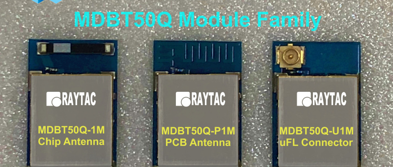

# The Stem MCU

The Stem manages the device when it is in a resting state receiving data and updates from outside.
It is responsible for being aware of the environment in order to wake the rest of the device under
certain conditions.
When awake it streams data between USB/Bluetooth and the other MCUs.

Responsibilities:

* To monitor Ambient Light, Human Presence, Device Movement
* To change state based on charging state & level
* Firmware/ML-Model updates over USB and Bluetooth
* Virtual USB file system
* To always be on
* Switching other MCUs on/off
* Programming other MCUs

The Stem is a [Nordic nRF52840](./datasheets/nRF52840_PS_v1.0.pdf) bundled in 
a [Raytac MDBT5Q](./datasheets/Raytac_nRF52840_MDBT50Q-1MV2_&_MDBT50Q-P1MV2_Ver.H_spec.pdf) module.




## Direct Inputs

The Stem receives most input over SPI, I2C, USB and I2S busses, but some inputs are received directly.

1. Up to 4 Analog Sensor inputs are connected directly for instance human body sensors
2. NFC antennas in front and below are directly input.
3. Interrupt requests from sensors and sensors are triggered on dedicated pins when states change.


## Stream/System SPI

1. SPI SCLK
2. Systems MOSI
3. Stream MOSI
4. Stream MISO


## I2C Sensors and Power

The Gut I2C connetion goes to the power module enabling power monitoring.
Other sensors that the Stem monitors are connected to the Gut I2C as well.

A revision may connect a second Stem I2C bus to sensors.

## Pinouts

```
	        Raytac	Dev Header	QSPI / Temp SPI	        I2C	    UART/LED        Direct Inputs
P0.00 D2	17				
P0.01 F2	18				
P0.02 A12	11	    1			                                                Analog Sensor Input 1
P0.03 B13	9	    3			                                                Analog Sensor Input 2
P0.04 J1	20                  				                O1 RXD
P0.05	    21                  				                O1 TXD
P0.06 L1	22				
P0.07 M2	23				
P0.08 N1	24				
P0.09 L24	52	    22			                                                NFC 1 Upper
P0.10 J24	54	    24			                                                NFC 2 Lower
P0.11 T12	27			                                Gut SCL	
P0.12 U1	29			                                Gut SDA	
P0.13 AD8	37		            Stream MOSI		
P0.14 AC9	36		            Stream SCK		
P0.15 AD10	39		            Stream MISO		
P0.16 AC11	38				                                    Monitor RXD
P0.17 AD12	41				                                    Monitor TXD
P0.18 AC13	40				
P0.19 AC15	42		            Control SPI SCK		
P0.20 AD16	44		            Control SPI MOSI / SDIO CMD		
P0.21 AC17	43		            Control SPI MISO / SDIO IO0 Recommended		
P0.22 AD18	46		            Control SDIO IO1 Recommended		
P0.23 AC19	45		            Control SDIO IO2 Recommended		
P0.24 AD20	48				                                    Temp RXD
P0.25 AC21	49				                                    Temp TXD
P0.26 G1	19		            Control SDIO IO3		
P0.27 H1	16		            ?? Stream spare ??		
P0.28 B11	13	    10			                                                Analog Sensor Input 3
P0.29 A10	10	    12			                                                Analog Sensor Input 4
P0.30 B9	14	    14			                                                ZIO 1
P0.31 A8	12	    16			                                                ZIO 2
P1.0 AD22	47	    9			FastLED DAT                                     ZIO 3
P1.1 Y23	61				                                                    Sensor 1 IRQ
P1.2 W24	50				                                                    Sensor 2 IRQ
P1.3 V23	60				                                                    Sensor 3 IRQ
P1.4 U24	56				
P1.5 T23	59				                                                    Charger IRQ
P1.6 R24	57				                                                    Light / Movement IRQ
P1.7 P23	58				
P1.8 P2	    25				                                    O2 RXD
P1.9 R1	    26				                                    O2 TXD
P1.10 A20	3	    15	        Controller is Master		
P1.11 B19	4				
P1.12 B17	5		            Control SPI Features CE1		
P1.13 A16	6		            Control SPI Features CE0		
P1.14 B15	7				                                                    ZIO 4
P1.15 A14	8				                                                    ZIO 5
D+					
D-					
ANT					
RST					
```				
