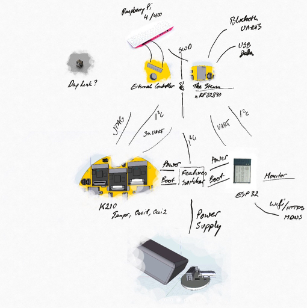

# Subsystems

The device is split into dedicated subsystems that will be switched on when needed. 
[The Stem](./STEM.md) will react to basic sensors indicating that something happened in the physical environment and turn on
the relevant subsystems to react.
The Monitor can be connected to provide a Web Interface to the device over WiFi.



Using [The Controller](./CONTROLLER.md) the device can be programmed in detail using a Raspberry Pi interface.
When the Controller isn't connected the Stem will be control the overall systems state.


## Power, Reset and Resting

[Feature bits](./FEATURES.md) are switched on/off to control the state of the Subsystems

When power is switched off on a subsystem using a feature pin, reset is pulled low. The actual switching power off is
delayed by 150ms or more, so if the feature pin is switched back on within 100ms, the power remains on.

For the overall system to be reseting the Sensor MCU Subsystems have to be switched off. 
Hence streaming doesn't happen during resting. 
When not resting one or more subsystems will be Awake. There can be different levels of wakefullness:

* Fully Resting: Only Stem is On 
* Fully Controlled: Stem is Off, others may be on or off
* Resting: Occi1, Occi2, Tempor are off.
* Partially awake: One of Occi1, Occi2, Tempor are on
* Fully awake: All of Occi1, Occi2, Tempor are on

To allow reaching known states there are a groups of resets that can be triggered:

* Reset all Subsystems
    Feature pin that will trigger reset on K210/ESP32 MCUs.
* Reset Internal control (features/...)
* Sound systems
* Light & movement


## Stem

[The Stem](./STEM.md) oversees the overall systems and provides a connection to USB and Bluetooth. It is a [Nordic nRF52840](./datasheets/nRF52840_PS_v1.0.pdf).

[The Stem Pinouts](./STEM.md#Pinouts)


## Occi1 & Occi2

The Occi receive camera input and analyses it real time. It uses a [Kendryte K210](./datasheets/kendryte_datasheet_20181011163248_en.pdf) packaged as an [Sipeed M1n m.2 module](./datasheets/sipeed_m1n_ggs_v1.0.pdf).

TODO pinouts

## Tempor

The Tempor is a spare MCU for processing Machine Learning models on other data in real time. It uses a [Kendryte K210](./datasheets/kendryte_datasheet_20181011163248_en.pdf) packaged as an [Sipeed M1n m.2 module](./datasheets/sipeed_m1n_ggs_v1.0.pdf).

TODO pinouts

## Monitor

The Monitor receives real time results from the other MCU and hosts them in a Web Page served over WiFi.
It uses an [ESP32 MCU](./datasheets/esp32_datasheet_en.pdf)  in an [ESP32 Pico D4 package](./datasheets/esp32-pico-d4_datasheet_en.pdf)

TODO pinouts

## Sensor systems

Human sensors
- Body sensor
- Movement sensor

Periodically on

Always on

TODO State diagram wakefullness of sensors


## K210 pinouts

Most of the pins on all 3 K210 are are connected the same. While the M1n module is used the SPI3 F_*
is not available, this will be changed in a future revision.

```	    	    
IO0	    JTAG_TCK	
IO1	    JTAG_TDI	
IO2	    JTAG_TMS	
IO3	    JTAG_TDO	
IO4	    ISP_RX	    
IO5	    ISP_TX	    
IO9	    Gut SDA	   
IO10	Gut SCL	   
IO14	Reserved Stream CS	
IO15	Stream CLK	
IO16	Stream MISO / BOOT	Stream MISO / BOOT
IO17	Stream MOSI	Stream MOSI
IO24	Control SPI D3	
IO25	Control SPI D2	
IO26	Control SPI MISO / SDIO IO0	
IO27	Control SPI SCK		
IO28	Control SPI MOSI / SDIO CMD
IO29	Control SPI D1	
IO30	Object I2C SCL	
IO31	Object I2C SDA	
IO32	Object I2C IRQ	
IO33	Speak WS
IO34	Speak DAT
IO35	Speak BCK
				
RST	    RST
GND	    GND
3.3V	3.3V	
5V	    3.5V / 5V	
1.8V		
1.5V		
2.8V		
				
F_CS		
F_CLK		
F_D0		
F_D1		
F_D2		
F_D3		
		
DVP_D0		
DVP_D1		
DVP_D2		
DVP_D3		
DVP_D4		
DVP_D5		
DVP_D6		
DVP_D7		
		
SPI0_D0		
SPI0_D1		
SPI0_D2		
SPI0_D3		
SPI0_D4		
SPI0_D5		
SPI0_D6		
SPI0_D7		
```		