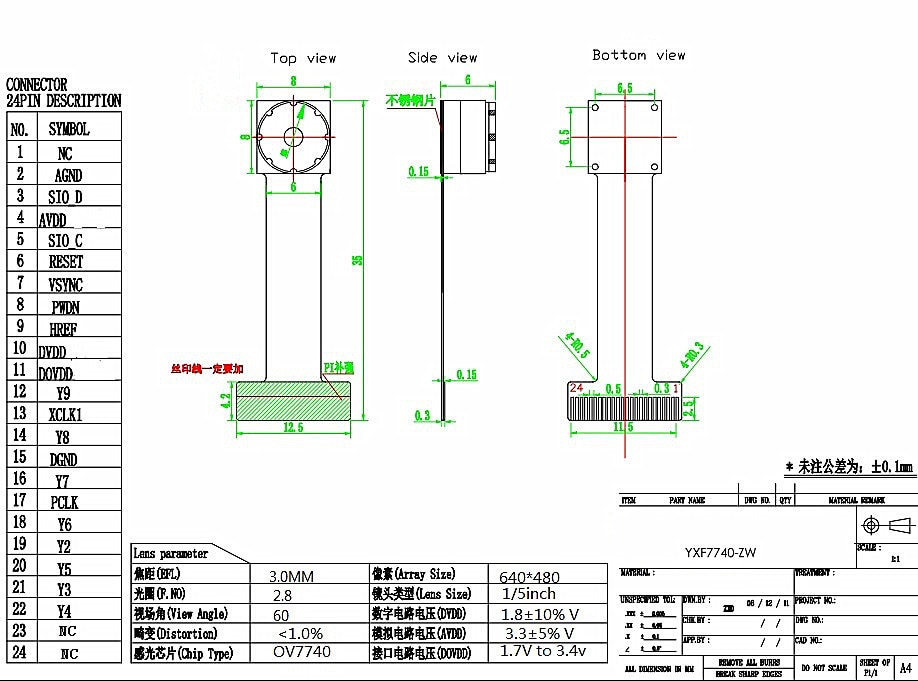
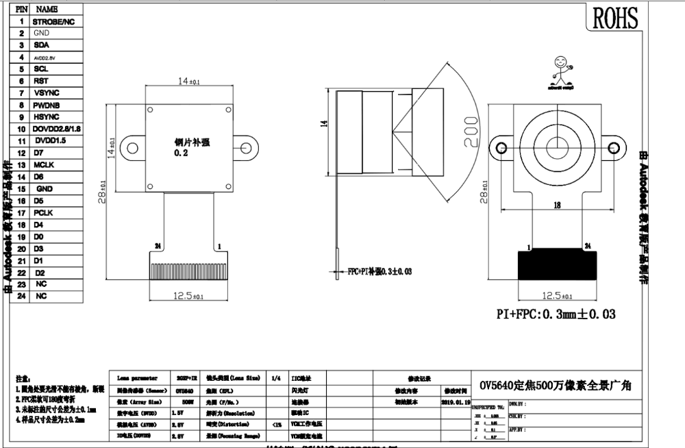
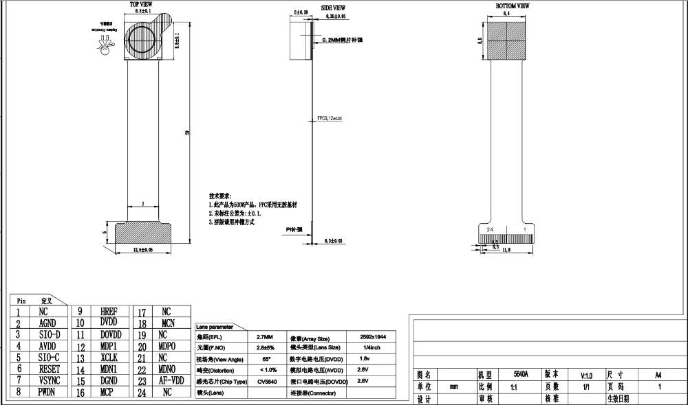

## Maix DVP Camera Connector

The documentation in the Diagrams lists the following connector. It seems reversed from most specifications.

1. Y0 / AFGND - Black
2. Y1 / AFVCC 3.3V - Red
3. Y4 / D2 - Green
4. Y3 / D1 - Blue
5. Y5 / D3 - Purple
6. Y2 / D0 - Grey
7. Y6 / D4 - Green
8. PCLK - Blue
9. Y7 / D5 - White
10. DGND - Black
11. Y8 / D6 - Purple
12. XCLK - Grey    MCLK?? XCLK1
13. Y9 / D7 - Brown
14. DOVDD / IOVDD 1.8V ? - Orange
15. DVDD 1.5V - Yellow
16. HREF / HSYNC - Brown
17. PWDN - White
18. VSYNC - White
19. RESET - Green
20. SCL / SIO_C - Yellow
21. AVDD 2.8V - Red
22. SDA / SIO_D - Orange
23. GND - Black
24. NC / STROBE

## Top Sensors to aim for

Comparison table for [2 - 5 megapixels](https://www.ovt.com/image-sensors/2-5-megapixels).

OV4689 4MP with Low-Light sensitivity and High Dynamic Range. 1/3 inch optical format. HDR. 2-micron OmniBIS-2 pixel for best in class low light.

Optical format 1/2.9" for larger sensor.

Global shutter to capture all at once.

Top candidates:

* OV2312 - 2MP 3um GlobalShutter
* OV5647 - 2MP 3um
* OV2710/15/35 - 2MP 3um RollingShutter 
* OG02B10
* OV2775 - 1080p 3um OmniBIS-2 HDR RollingShutter
* OV2778 - 1080p 3um OmniBIS-2 HDR DeepWell RollingShutter

OV2778 seems to be ideal.

OV2715-1E perhaps more realistic

### Connector 

AXT524124 seems the standard
https://www.digikey.com/en/products/detail/panasonic-electric-works/AXT524124/1987298

### OV2640 2MP

1600x1200
800x600 30fps
Can output JPEG buffer

### OV5640 5MP

Can output JPEG buffer

### OV5647 Raspberry Pi cam module

###

### OV2640 2.1cm 66/120/160 degree Suitable for ESP32 OV2640 2 million pixel camera module 24pin

Very vivid performance

Order 08:42 Apr. 16 2020
[8012842970248977](https://trade.aliexpress.com/order_detail.htm?spm=a2g0s.9042311.0.0.27424c4dT07yA9&orderId=8012842970248977)

https://www.aliexpress.com/item/4000130467485.html?spm=a2g0s.9042311.0.0.27424c4dsa8Fj6

### OV7740 module camera 300,000 pixels 24PIN total length: 34MM

Works well

Order 8121748715548977 
Sep. 18, 2020   Shenzhen Duoweisi Tech Co., Ltd.

https://www.aliexpress.com/item/33027324977.html?spm=a2g0s.9042311.0.0.27424c4dE91JRE

AVDD 3.3V +- 5%
DVDD 1.8V +- 10%
DOVDD 1.7V .. 3.4V

1. NC
2. AGND
3. SIO_D
4. AVDD 3.3V
5. SIO_C
6. RESET
7. VSYNC
8. PWDN
9. HREF
10. DVDD 1.8V
11. DOVDD ?V
12. Y9
13. XCLK1
14. Y8
15. DGND
16. Y7
17. PCLK
18. Y6
19. Y2
20. Y5
21. Y3
22. Y4
23. NC
24. NC

### 6cm OV5640 160 degree wide angle lens 5-megapixel camera module OV5640

Working 

Order ID: 8118752732188977 2020-9-30

https://www.aliexpress.com/item/4000364569365.html?spm=a2g0s.9042311.0.0.27424c4dTZqx8Y

https://trade.aliexpress.com/order_detail.htm?spm=a2g0s.9042311.0.0.27424c4dTZqx8Y&orderId=8118752732188977

### OV7725 night vision good wide-angle 150 degree can be used for video intercom door lock camera module

Order 8121748715548977 2020-11-21

https://www.aliexpress.com/item/32843251661.html?spm=a2g0s.12269583.0.0.2ccf6de70ZmnWN

Array size 640 x 480
Pixel size 6um x 6um

GRB422 RGB565 RGB555 YCC422 RawRGB

### OV7725 300,000 pixe wide-angle 160 degree for video intercom door lock camera module Suitable for ESP32 Night vision HDF7725-A32

Order 8121748715548977 2020-11-21

https://www.aliexpress.com/item/1000005245165.html?spm=a2g0s.9042311.0.0.27424c4dfKBHAe
https://trade.aliexpress.com/order_detail.htm?spm=a2g0s.9042311.0.0.27424c4dfKBHAe&orderId=8121514428678977

### OV5640 use for Sports DV, Intelligent parking equipment 180-degree camera module 24PIN 0.5MM Pitch

Working

Nov 3 2020
Duowesi

Order ID: 8120432798148977

1. STROBE/NC
2. AGND
3. SDA / SIO_D
4. AVDD 2.8V
5. SCL / SIO_C
6. RESET
7. VSYNC
8. PWDNB
9. HSYNC (HREF?)
10. D0VDD 2.8V/1.8V (swapped?)
11. DVDD 1.5V
12. D7 / Y9
13. MCLK
14. D6 / Y8
15. DGND
16. D5 / Y7
17. PCLK
18. D4 / Y6
19. D0 / Y2
20. D3 / Y5
21. D1 / Y3
22. D2 / Y4
23. NC
24. NC

## OV7740 camera module 120 degree viewing angle 24PIN with infrared filter total length: 34MM

Nov 3 2020
Duowesi

Order ID: 8120432798148977

Array size 656*488
DVDD 1.5V +-5%
AVDD 3 .. 3.6V
D0VDD 1.7V .. 3.47V

1. NC
2. AGND
3. SIO_D
4. AVDD 2.8V
5. SIO_C
6. RESET
7. VSYNC
8. PWDN
9. HREF
10. DVDD 1.8V
11. D0VDD 2.8V
12. Y9
13. XCLK1
14. Y8
15. DGND
16. Y7
17. PCLK
18. Y6
19. Y2
20. Y5
21. Y3
22. Y4
23. NC
24. NC

## 5 million pixel OV5640 AF chip camera module 24PIN auto focus line length 50MM

Fixed with Autofocus

View Angle 65deg
Array Size 2592x1944
DVDD 1.8V
AVDD 2.8V
D0VDD 2.8VV

1. NC
2. AGND
3. SIO-D
4. AVDD 2.8V
5. SIO-C
6. RESET
7. VSYNC
8. PWDN
9. HREF
10. DVDD 1.8V
11. D0VDD 2.8V
12 MDP1
13. XCLK
14. MDN1
15. DGND
16. MCP
17. NC
18. MCN
19. NC
20. MDP0
21. NC
22. MDN0
23. AF-VDD
24. NC

### References

RPi OV5647 module connector
https://www.win-source.net/rectangular-boardto-board-connectors-axk7l24223g.html

