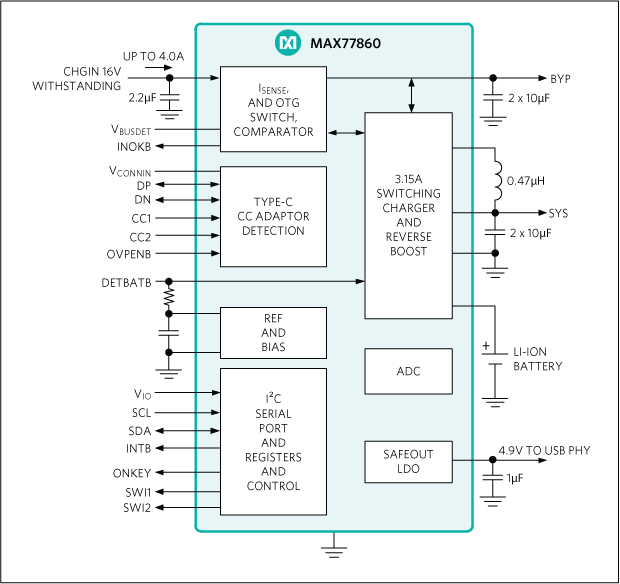

The Bottom Board is used to get USB power and signal into our consumer device.
It is matched by a Sibling Connector (Base) Board, which is part of a charging and programming base platform.

The Bottom Board sits on the bottom of the Power Module. It takes in the equivalent of USB Type C and passes on up to 2A 3.5V - 4.4V over a Flexi PCB connection along with signals to control charging. 
It is also responsible for charging a LiPo battery that supplies power when USB isn't connected.

The consumer of the power is a Ziloo Experiential Research IoT device that is always on. 
It may have switched of most parts, but the central MCU(nRF52840) will always be on, 
so will always need a power supply, and there is no need for an off switch.

As part of the board design the I2C settings needed in response to RESET must be documented.

The power module will have a single red LED that reflects the status of the charging/power. 
When everything is fine it should be off. Options for generating pulsing/ON LED signals should also be
explored.

The MAX77860 provides additional functionality that isn't used. It would be good to have a summary of
what they are for future consideration.

The initial version of the board should be considered an initial effort. There are open issues that cannot
be resolved with the initial version.


#### Connectors and Connections

The underside of the board will have a layout of connection, which reflects USB C pins, that will be transferred to an external surface (a bit like the 3 pin power connector on the side of iPad Pro). Metal contact springs will be placed on
top of the copper isles.

A + and - island reflect USB 5V and GND. Inbetween there is a grid of 9 dots. 
These will all be mirrored by an opposing second Base Board which supplies a 
typical USB charger facility. The connector may also be used for USB 2.0 communication, 
and extended with USB PD/3 Alternate higher speed communication in the future.

The layout of underside isles is

```  
 +     D-   RX-  TX- 
+++    D+   RX+  TX+   ---
 +     SBU1 CC   SBU2
```


Source Current Capability       Current Source to 1.7V - 5.5V       Rp pull-up to 3.3V ±5%      Rp pull-up to 4.75V - 5.5V
Default USB power               80μA ±20%                           36kΩ ±20%                   56kΩ ±20%
1.5A @5V                        180μA ±8%                           12kΩ ±5%                    22kΩ ±5%
3.0A @5V                        330μA ±8%                           4.7kΩ ±5%                   10kΩ ±5%

On the upperside of the board a [20 pin vertical FPC connector](./CONNECTORS.md#20-pin-power-supply-connector-522072033) exposes the power and charging state.


#### Module Status Indication

The overall power module will have a red LED to to indicate failure of the module by lighting up or pulsing. Ideally it would be able to indicate:

* Discharged or Dead Battery
* Overheating or Fault
* Missing Battery
* 


#### Output voltage V_SYS

If the datasheet is correctly understood the typical output will be 4.4V dropping under load down to 3.6V.
This seems to be the performance with default register settings. This range is perfect for the need as it just need to be high enough to be reliably down-regulated to 3.3V on the MCU board.


#### Charger

[Maxim MAX77860](./MAX77860.pdf)
EITA-Compliant, Li+ Charger with Smart Power Selector, Automatic Detection, and USB Enumeration



* I2C controlled (400kHz)
* Automatic Enumeration Enable
* Output V_SYS 3.5V+ 
* IBUS_DEF = ILIM
* Running in Always On mode
* Optional status LEDs on board


https://www.maximintegrated.com/en/products/power/power-management-ics.html

A thermistor terminal should be placed on the board to allow battery temperature monitoring.

Note that the D- D+ power lines are routed to an nRF52840, which will be communicating over the DATA lines
after a connection has been established.


#### USB-C PD negotiation

The CC pin is laid out for future use. USB 3 charging options will not be relevant currently.
It would be used to negotiate Alternate mode.

https://www.silabs.com/community/mcu/8-bit/knowledge-base.entry.html/2016/09/26/what_s_the_role_ofc-kQYe


#### Data Pins

The 6 data pins of USB3 must pass through.
They must be well protected from ESD as they are going straight to the central MPU.

The USB3 Data lines are expected to be used in Alternate Mode via USB PD protocol Vendor Defined Messages.


#### Maximum ESD ECM protection

The board must provide the maximum protection

* Child touching it with a tongue
* 20k ESD
* Shorted
* Reverse voltage. If connector is reversed, it shouldn't damage components, but there is a correct orientation.
* Passing tests for IEC 61000-4-2

For the dataline protection it seems that Nexperia PCMF3USB3B/C WLCSP15 (3 channel) covers most of the needed pieces. Perhaps the protection built into MAX77860 is sufficient, and only 2 channels are needed.

For power line the primary thing I can see is to ensure that the open connector doesn't supply any significant current output.

Should a resettable fuse be added to the USB power line?
https://www.littelfuse.com/products/polyswitch-resettable-ptcs.aspx
https://en.wikipedia.org/wiki/Resettable_fuse
https://www.arrow.com/en/categories/circuit-protection/overcurrent-protection/ptc-resettable-fuses


