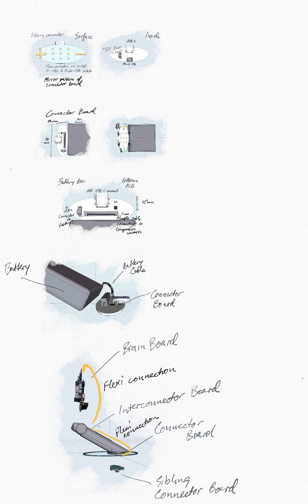

# High performance Battery Power 

The power module is able to deliver 3.3V at 2A over sustained periods and recharge the battery at the
same time. It provides a charging+data connection via USB-C and a contact surface.

1. [Bottom board](./BOTTOM_BOARD.md) which prove the Underside Connector Isles reflecting USB-C pins.
2. [Reverse Sibling board](./SIBLING_BOARD.md) which has the mirror of the Isles on the Bottom board and is external.
3. [Slide-in board](./SLIDE-IN_BOARD.md) which passes power and signals to the device via 12 compression pins.

Still outstanding,

* Design diagrams boards 2 & 3
* Review the designs for future European compliance application
* Plan ways to quality test the board
* Consider design improvements towards assembly and production

## Visual overview 

