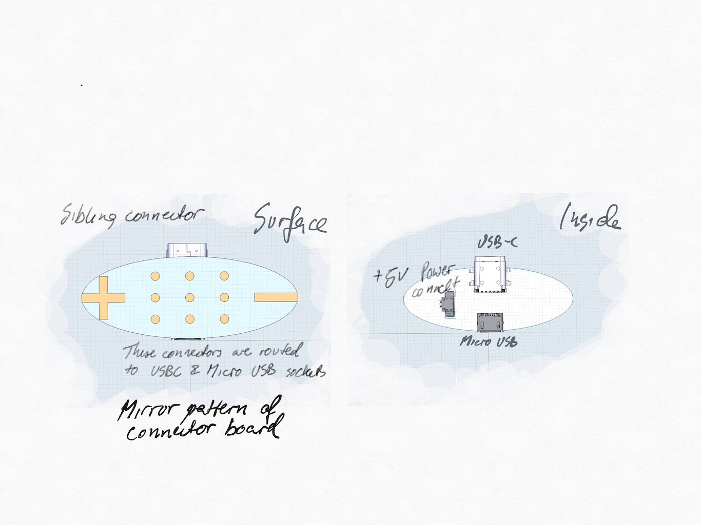

The Sibling Connector Board is part of a charging and programming platform,
it is used to supply USB power and signal into our consumer device.
It is matched by a Bottom Connector Board which connects to the underside of our consumer device.




#### Connectors and Connections

The underside of the board will have a layout of connection that will be transferred to an external surface (a bit like the 3 pin power connector on the side of iPad Pro). Metal contact springs will be placed on
top of the copper isles.

The top side will prove vide routing of the connection to USB-C, Micro USB, 2 pin plug and header.

The USB-C will be mapped to the 2 power isles and 9 data isles.
The Micro USB will be mapped to the 2 power isles, D+ and D-
The 2 pin JST style plug will be mapped to +/-
The header should be a male 12 pin mapped to all isles.


The layout of underside isles is

Front
  
```  
       TX-  RX-  D-       + 
---    TX+  RX+  D+      +++
       SBU2 CC   SBU1     +
```

CC is optionally connected to a resistor to signal higher current (1.5A) draw on the connection. 
Or equivalent fixed wiring to negotiate high current charging.


Back

The data header must be surface mounted so an option is something similar to 1674000-2
https://www.te.com/usa-en/product-1674000-2.html?q=amp%2Bheader&d=545671%20545287&type=products&samples=N&inStoreWithoutPL=false&instock=N


#### Maximum ESD ECM protection

The board must provide the maximum protection

* Child touching it with a tongue
* 20k ESD
* Shorted
* Will it handle if a connection is made with an opposite or different voltage?
* Passing tests for IEC 61000-4-2

For the dataline protection it seems that Nexperia PCMF3USB3B/C WLCSP15 (3 channel) covers most of the needed pieces. 

Should a resettable fuse be added to the USB power line?
https://www.littelfuse.com/products/polyswitch-resettable-ptcs.aspx
https://en.wikipedia.org/wiki/Resettable_fuse
https://www.arrow.com/en/categories/circuit-protection/overcurrent-protection/ptc-resettable-fuses


