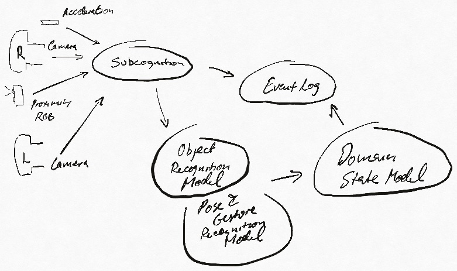

# Ziloo

Ziloo is an independent device that sees and senses the environment. It recognises objects and behavior based on what it has been taught. It outputs an event log describing what is perceived.

It receives stereo video input over 2 x 2-lane MIPI CSI2. Additionally it receives sensor input over I2C
for distance, color, brightness. The sensor inputs are processed and disected to identify objects, people and
behaviour. Ziloo can connect over USB or WiFi to make the output available.

## Sensor pipeline

The sensor inputs are arranged in a pipeline to avoid unneeded processing.

Sensor Pipeline Camera - Subcognition - Object & Posture Vision Models - State Model - Event Log

## Ziloo State process

The state captures what is known and a memory of what has happened in the environment. 
The state is received from the Subcognition and Awareness processes over IPC Message Queue.
The state process can be scripted to react to changes.
